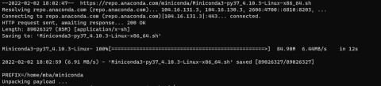
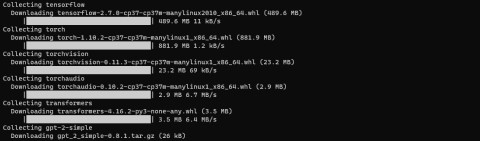
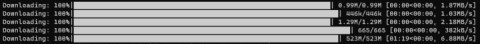
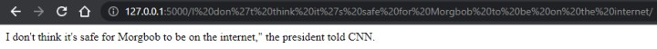

# [atet](https://github.com/atet) / [**_ggj2022_**](https://github.com/atet/ggj2022/blob/main/README.md#atet--ggj2022)

[](#nolink)

# Global Game Jam 2022: TinderBot API

These are instructions to create the back-end API that generates text for: <URL_TO_GGJ2022_GAME>

--------------------------------------------------------------------------------------------------

## Table of Contents

### Introduction

* [0. Preface](#0-preface)
* [1. Requirements](#1-requirements)
* [2. Installation](#2-installation)
* [3. Interactive Python](#3-interactive-python)
* [4. Application Programming Interface](#4-application-programming-interface)
* [5. Next Steps](#5-next-steps)

### Supplemental

* [Other Resources](#other-resources)
* [Troubleshooting](#troubleshooting)
* [Acknowledgments](#acknowledgments)

--------------------------------------------------------------------------------------------------

## 0. Preface

* We will install the [GPT-2 model](https://en.wikipedia.org/wiki/GPT-2) to generate human-like text on our local computer
* Here is a fun example of using it to finish a sentence:

  > `Input : "Morgbob is the"`
  >
  > `Output: "Morgbob is the best thing you can do."`

[Back to Top](#table-of-contents)

--------------------------------------------------------------------------------------------------

## 1. Requirements

### Local Computer

Your local computer (e.g. home laptop and/or desktop) will need to have:

* Broadband internet, as we will have to download some pretty big files
* ≥8 GB of RAM
* ≥10 GB of free disk space

### Command Line Interface (CLI)

A Linux CLI will be used to execute commands on our server; if you feel like you need a refresher, please see: https://github.com/atet/learn/tree/master/regex

You can use the following CLI depending on your operating system:

#### Windows 10

* Windows Subsystem for Linux (WSL) is a fully supported Microsoft product for Windows 10, learn how to install it here: [https://docs.microsoft.com/en-us/windows/wsl/install-win10](https://docs.microsoft.com/en-us/windows/wsl/install-win10)
* Please choose Ubuntu 18.04 LTS as the distribution you use with WSL
* WSL is only available for Windows 10

#### MacOS

* You do not need to install anything, [your Terminal program is sufficient](https://en.wikipedia.org/wiki/Terminal_(macOS))

#### Linux

* I recommend using Ubuntu 18.04 LTS

[Back to Top](#table-of-contents)

--------------------------------------------------------------------------------------------------

## 2. Installation

Each of the following steps will download hundreds of MBs of dependencies in order to run GPT-2, depending on you internet connection, some of the following steps can take ≥10 minutes or more each; _plenty of coffee breaks here_

### Update Everything

* Start up your CLI and make sure you have set up your user with `sudo` privileges and run the following to update everything:

```console
$ sudo apt update && sudo apt -y upgrade
```

### Python

* We will install Python 3 through Miniconda in one line:
   * Must use older Python 3.7 or earlier, not the latest
   * The last command ("`exit`") will log you out, this is required

```console
$ cd ~ && \
  wget https://repo.anaconda.com/miniconda/Miniconda3-py37_4.10.3-Linux-x86_64.sh && \
  bash Miniconda3-py37_4.10.3-Linux-x86_64.sh -b -p $HOME/miniconda && \
  echo 'export PATH="$HOME/miniconda/bin:$PATH"' >> ~/.bashrc && \
  exit
```

[](#nolink)

* Log back into your user and confirm with the "`which`" command that Python from Miniconda is installed:

```console
$ which python
/home/<USER>/miniconda/bin/python
```

### Dependencies

* Now we will download all the required Python packages:

```console
$ pip3 install tensorflow torch torchvision torchaudio transformers gpt-2-simple
```

[](#nolink)

* Before we play with GPT-2, let's start up a Python session and download a few more things:

```python
$ python
Python 3.7.10 (default, Jun  4 2021, 14:48:32)
[GCC 7.5.0] :: Anaconda, Inc. on linux
Type "help", "copyright", "credits" or "license" for more information.
>>> import torch; from transformers import GPT2LMHeadModel, GPT2Tokenizer; tokenizer = GPT2Tokenizer.from_pretrained('gpt2'); model = GPT2LMHeadModel.from_pretrained('gpt2'); quit()
```

[](#nolink)

[Back to Top](#table-of-contents)

--------------------------------------------------------------------------------------------------

## 3. Interactive Python

We now have everything needed to use GPT-2, let's start up another Python session and execute the following lines:
   * If you see warnings, you may be able to ignore them and move on

```python
>>> import torch; from transformers import GPT2LMHeadModel, GPT2Tokenizer; tokenizer = GPT2Tokenizer.from_pretrained('gpt2'); model = GPT2LMHeadModel.from_pretrained('gpt2')
>>> input = 'Morgbob and Borgmob are not real, they cannot'
>>> output = tokenizer.decode(model.generate(tokenizer.encode(input, return_tensors='pt'), max_length = 15, do_sample=True)[0], skip_special_tokens=True); print(output)

Setting `pad_token_id` to `eos_token_id`:50256 for open-end generation.
2022-02-02 18:20:35.497111: W tensorflow/stream_executor/platform/default/dso_loader.cc:64] Could not load dynamic library 'libcudart.so.11.0'; dlerror: libcudart.so.11.0: cannot open shared object file: No such file or directory
2022-02-02 18:20:35.498338: I tensorflow/stream_executor/cuda/cudart_stub.cc:29] Ignore above cudart dlerror if you do not have a GPU set up on your machine.

Morgbob and Borgmob are not real, they cannot be killed.
```

_Well, that's an interesting response... thanks GPT-2 for giving me something new to worry about_ (you will get different responses than this tutorial)

If you want to continue to play around with GPT-2 within an interactive Python session, you can change the starting prompt "`input`" to something else, but remember to change the variable "`max_length`" to a larger number of words if you require more in the output (input words count towards this number)

```python
>>> input = 'GPT-2 don\'t be so creepy, you\'re making me' # Use escape characters for single quotes
>>> output = tokenizer.decode(model.generate(tokenizer.encode(input, return_tensors='pt'), max_length = 20, do_sample=True)[0], skip_special_tokens=True); print(output)

Setting `pad_token_id` to `eos_token_id`:50256 for open-end generation.

GPT-2 don't be so creepy, you're making me cry!
```

_Hmm, ok GPT-2, moving on..._

[Back to Top](#table-of-contents)

--------------------------------------------------------------------------------------------------

## 4. Application Programming Interface

Congratulations on deploying GPT-2 to work locally on your computer, let's try to package this capability up into something more practical, such as an API ([application programming interface](https://www.ibm.com/cloud/learn/rest-apis))

We will use the Flask framework to supercharge our capability into the web, so quit Python and install Flask:

```console
>>> quit()
$ pip3 install flask && nano ~/miniconda/api.py
```

The above command will create a new file called "`api.py`" in the "`nano`" text editor

Copy and paste the code below and press `CTRL+o` then `ENTER` to save and `CTRL+x` to exit the `nano` text editor

```python
import torch
from flask import Flask
from transformers import GPT2LMHeadModel, GPT2Tokenizer
app = Flask(__name__)
tokenizer = GPT2Tokenizer.from_pretrained('gpt2')
model = GPT2LMHeadModel.from_pretrained('gpt2')
@app.route('/<string:input>/')
def tinderbot(input=None):
   count_words_input = len(input.split(' ')) # Word count of input
   count_additional_words = 10 # The higher the number, the longer processing with take
   count_max_length = count_words_input + count_additional_words # New total length of output including input
   output = tokenizer.decode(model.generate(tokenizer.encode(input, return_tensors='pt'), max_length = count_max_length, do_sample=True)[0], skip_special_tokens=True)
   return output
if __name__ == '__main__':
   app.run()
```

### Run the Flask Application

Once you save this `api.py` script, you just need to run it:
   * This will take up to a minute to load up

```console
$ python ~/miniconda/api.py
* Serving Flask app 'api' (lazy loading)
* Environment: production
  WARNING: This is a development server. Do not use it in a production deployment.
  Use a production WSGI server instead.
* Debug mode: off
* Running on http://127.0.0.1:5000/ (Press CTRL+C to quit)
```

You will be presented with instructions to access your API through your web browser at: `http://127.0.0.1:5000/`

On the same computer that you're running your Python code, go to your favorite web browser and enter a prompt after the URL like this and press `ENTER`:
   * You can have spaces and _some_ special characters, see [Other Resources: Special Characters in a URL](#special-characters-in-a-url)

[](#nolink)

And there you have it, GPT-2 served as an API through a web browser!
   * Your web browser will likely convert non-alphanumeric characters to the special escaped characters

[](#nolink)

And just like the anonymous president told CNN, it's not safe to put our API on the internet...yet; your GPT-2 API is only accessible on your local computer

You have reached the end of this tutorial, deploying your API to the public internet is beyond the scope of this quick tutorial

### OPTIONAL: Cleanup

If you don't need to use GPT-2 after this tutorial and would rather have 5+ GBs of disk space back, you can remove the entire `~/miniconda` directory:

**WARNING: The "`rm -rf`" command is very powerful as it will send the target file or directory into oblivion, never to be seen again; be extra certain this is what you want to do, there's no "Recycling Bin" in CLI**

```console
$ rm -rf ~/miniconda
```

--------------------------------------------------------------------------------------------------

## 5. Next Steps

The local installation of GPT-2 as an API on your local computer is not readily accessible by others through the internet

Deploying this so others can access your API is beyond the scope of this tutorial

Here are some next steps to unleash your new capability to the world:

1. Do the same thing we just did locally, but in the cloud: https://learn.adafruit.com/a-digitalocean-droplet-in-10-minutes
2. Secure your traffic with encryption (i.e. `HTTPS://` instead of `HTTP://`) and authentication (API tokens and/or `username`:`password`)
3. Extra functionality such as a profanity filter (GPT-2 responses can get spicy!)

[Back to Top](#table-of-contents)

--------------------------------------------------------------------------------------------------

## Other Resources

### Special Characters in a URL

You must escape the following characters in a URL, for example, "`Price = $9.99`" must be "`Price%20%3D%20%249.99`"

| Character | Escape Character | Character | Escape Character |
| -: | :- | -: | :- |
| `<SPACE>` | %20 | `#` | %23 |
| `$` | %24 | `%` | %25 |
| `&` | %26 | `@` | %40 |
| `<BACKTICK>` | %60 | `/` | %2F |
| `:` | %3A | `;` | %3B |
| `<` | %3C | `=` | %3D |
| `>` | %3E | `?` | %3F |
| `[` | %5B | `\\` | %5C |
| `]` | %5D | `^` | %5E |
| `{` | %7B | `\|` | %7C |
| `}` | %7D | `~` | %7E |
| `"` | %22 | `'` | %27 |
| `+` | %2B | `,` | %2C |

### External Tutorials

Description | Link
--- | ---
**"A cloud server what now?"** | https://learn.adafruit.com/a-digitalocean-droplet-in-10-minutes
**"I want to learn Python"** | https://github.com/atet/learn/tree/master/programming
**"MOAR MORGBOB!!!"** | https://www.morgbob.com

[Back to Top](#table-of-contents)

--------------------------------------------------------------------------------------------------

## Troubleshooting

Issue | Solution
--- | ---
**"It's not working!"** | This concise tutorial has distilled hours of sweat, tears, and troubleshooting; _it can't not work_

[Back to Top](#table-of-contents)

--------------------------------------------------------------------------------------------------

## Acknowledgments

* > "Some inspirational quote about collaboration and synergy." - Unknown
* Angela, for contributing to our off-the-wall brainstorming session
* [Team DERP](https://globalgamejam.org/2020/games/rapid-restoration-4) + [Team Orenji Gaijin](https://github.com/atet/ggj2021) =

<div style="text-align: center"><a href="#nolink"></a></div>

[Back to Top](#table-of-contents)

--------------------------------------------------------------------------------------------------

<p align="center">Copyright © 2022-∞ Athit Kao, <a href="http://www.athitkao.com/tos.html" target="_blank">Terms and Conditions</a></p>